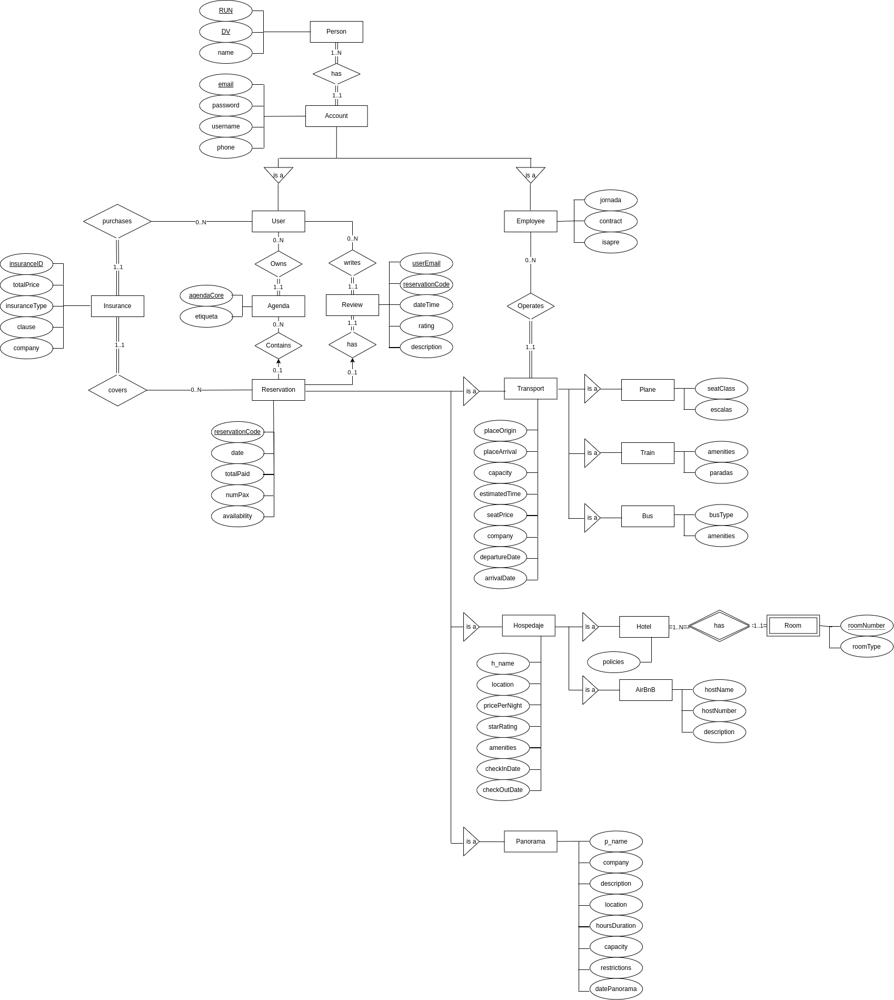

# Entrega 1 - IIC2413 Databases

- [Entrega 1 - IIC2413 Databases](#entrega-1---iic2413-databases)
  - [Student Information](#student-information)
  - [UC Access Credentials](#uc-access-credentials)
  - [1. E/R Model](#1-er-model)
  - [2. Identification of Weak Entities and Justification](#2-identification-of-weak-entities-and-justification)
    - [2.1 ROOM (Weak Entity under HOTEL)](#21-room-weak-entity-under-hotel)
  - [3. Identification of Primary/Composite Keys and Justification](#3-identification-of-primarycomposite-keys-and-justification)
  - [4. Explanation of Cardinalities in the E/R Model](#4-explanation-of-cardinalities-in-the-er-model)
  - [5. Identification of Hierarchies](#5-identification-of-hierarchies)
  - [6. Relational Schema (BCNF)](#6-relational-schema-bcnf)
  - [7. Justification of Tables for Relationships](#7-justification-of-tables-for-relationships)
  - [8. Justification Regarding BCNF and Design Consistency](#8-justification-regarding-bcnf-and-design-consistency)


## Student Information

| **Full Name**     | **Student Number** |
|-------------------|--------------------|
| William Aarland   |      25401068      |

## UC Access Credentials

| **UC Username**                     | **Password** |
|------------------------------------|-------------|
| waarland0@bdd1.ing.puc.cl           | 24410853   |

---

## 1. E/R Model
Below is our final E/R diagram for the Booked.com scenario. It includes:

- **PERSON**, which contains basic identifiers (`run`, `dv`, `name`).
- **ACCOUNT**, holding login details (`email`, `password`, `username`, `phone`).
- An **ISA** hierarchy from **ACCOUNT** to **USER** and **EMPLOYEE**.
- **AGENDA** (associated with a single `USER`).
- **RESERVATION** (associated 0..1 with an `AGENDA`).
- An **ISA** hierarchy from **RESERVATION** to `Transport`, `Hospedaje`, and `Panorama`.
- A further **ISA** split from `Transport` to `Plane`, `Train`, and `Bus`, and from `Hospedaje` to `Hotel` and `AirBnB`.
- **ROOM** as a weak entity of `Hotel`.
- **INSURANCE** that a `User` can purchase to cover a particular `Reservation`.
- **REVIEW** is related to both `User`, and `Reservation` and therefore has a composite key by `(userEmail, reservationCode)`.



---

## 2. Identification of Weak Entities and Justification

### 2.1 ROOM (Weak Entity under HOTEL)

In the diagram, **ROOM** is a weak entity. Its partial key is `roomNumber`, which is unique **only** within the context of a specific `Hotel`. We use a double diamond for the identifying relationship **“has”** between `Hotel` and `Room`. If a given `Hotel` is removed, its `Room` entities become invalid.

---

## 3. Identification of Primary/Composite Keys and Justification

Below are examples from our model. (Adjust if any names differ in your diagram.)

1. **PERSON**  
   - Primary Key: `(run, dv)`  
   - Justification: The Chilean RUN + DV combination uniquely identifies each person.

2. **ACCOUNT**  
   - Primary Key: `email`  
   - Justification: Each account is uniquely identified by an email address.

3. **USER**  
   - Primary Key: `email` (FK to `ACCOUNT`)  
   - Justification: The same email used in `ACCOUNT` extends into `USER`, ensuring 1:1 mapping.

4. **EMPLOYEE**  
   - Primary Key: `email` (FK to `ACCOUNT`)  
   - Justification: Similarly, references `ACCOUNT(email)`, forming a 1:1 subtype relationship.

5. **AGENDA**  
   - Primary Key: `agendaCode`  
   - Justification: A single integer or code to uniquely identify each agenda.

6. **RESERVATION**  
   - Primary Key: `reservationCode`  
   - Justification: Each reservation is uniquely identified by its code.

7. **REVIEW**  
   - Primary Key: `(userEmail, reservationCode)`  
   - Justification: A single user leaves one review for a specific reservation. This pair collectively forms a unique identifier.

8. **INSURANCE**  
   - Primary Key: `insuranceID`  
   - Justification: We generate a unique ID for each insurance policy.

9. **ROOM**  
   - **Weak Entity** with partial key `roomNumber` under the relationship of `Hotel`.  
   - Justification: `roomNumber` is only unique in the scope of its parent hotel.

---

## 4. Explanation of Cardinalities in the E/R Model

1. **PERSON —HAS— ACCOUNT**  
   - **(1:N)** A Person can have multiple Accounts (different emails).  
   - **(N:1)** An Account belongs to exactly one Person.

2. **ACCOUNT —ISA— USER, EMPLOYEE**  
   - Each Account may be specialized as a User or an Employee.  
   - In the diagram, `USER` and `EMPLOYEE` each inherit the `email` PK from `ACCOUNT`.

3. **USER —OWNS— AGENDA**  
   - **(1:N)** A single User may own multiple Agendas.  
   - **(N:1)** Each Agenda belongs to exactly one User.

4. **AGENDA —CONTAINS— RESERVATION**  
   - **(1:N)** An Agenda can contain many Reservations.  
   - **(0..1)** A Reservation can appear in at most one Agenda (if it’s “booked” by a user).

5. **RESERVATION —ISA— (PANORAMA, HOSPEDAJE, TRANSPORT)**  
   - No numeric cardinalities on the ISA itself, but each subtype inherits `reservationCode`.

6. **HOSPEDAJE —ISA— (HOTEL, AIRBNB)**  
   - Again, no numeric cardinalities. Each lodging is either a Hotel or an AirBnB.

7. **HOTEL —HAS— ROOM** (Identifying Relationship)  
   - **(1:N)** A single Hotel can have many Rooms.  
   - `ROOM` depends on `HOTEL` for its identity, hence a weak entity.

8. **TRANSPORT —ISA— (BUS, TRAIN, PLANE)**  
   - Additional subtyping. Each Transport is exactly one of these sub-variants.

9. **EMPLOYEE —OPERATES— TRANSPORT**  
   - **(0:N)** One Employee can operate many Transport reservations.  
   - **(N:1)** A Transport is operated by exactly one Employee.

10. **USER —purchases— INSURANCE —covers— RESERVATION**  
    - **(1:N)** from `User` to `Insurance` (one user can buy multiple insurance policies).
    - **(N:1)** from `Insurance` to `Reservation` (one insurance policy covers exactly one reservation).

11. **USER —writes— REVIEW —has— RESERVATION**  
    - A “bridge” scenario: one user can leave many reviews. One reservation can have zero, or one review. One review always has one, and only one user, and reservation.
  
---

## 5. Identification of Hierarchies

Our diagram shows several **ISA** relationships:

1. **ACCOUNT → USER, EMPLOYEE**  
   - Shared login attributes in `ACCOUNT`, specialized fields in `USER` (puntos) and `EMPLOYEE` (jornada, contrato, isapre).

2. **RESERVATION → TRANSPORT, HOSPEDAJE, PANORAMA**  
   - Common booking attributes in `RESERVATION`, specialized attributes in each subtype (e.g., `placeOrigin` for transport, `h_name` for hospedaje, etc.).

3. **HOSPEDAJE → HOTEL, AIRBNB**  
   - Further specialization of lodging reservations.

4. **TRANSPORT → BUS, TRAIN, PLANE**  
   - Variation of transportation modes, each with unique attributes (e.g., `busType` for `Bus`, `escalas` for `Plane`).

In all these ISA relationships, the sub-entities inherit `reservationCode` or `email` as their primary key from the parent entity.

---

## 6. Relational Schema (BCNF)

Here is a **sample** of how these entities/relationships could be converted to tables. (In your final submission, list all tables for each entity and relationship as needed.)

```sql
-- PERSON
CREATE TABLE Person (
  run INT,
  dv CHAR(1),
  name VARCHAR(60),
  PRIMARY KEY (run, dv)
);

-- ACCOUNT
CREATE TABLE Account (
  email VARCHAR(100) PRIMARY KEY,
  run INT NOT NULL,
  dv CHAR(1) NOT NULL,
  password VARCHAR(100),
  username VARCHAR(50),
  phone VARCHAR(20),
  FOREIGN KEY (run, dv) REFERENCES Person(run, dv)
);

-- USER (ISA subtype of ACCOUNT)
CREATE TABLE User (
  email VARCHAR(100) PRIMARY KEY,
  puntos INT,
  FOREIGN KEY (email) REFERENCES Account(email)
);

-- EMPLOYEE (ISA subtype of ACCOUNT)
CREATE TABLE Employee (
  email VARCHAR(100) PRIMARY KEY,
  jornada VARCHAR(20),
  contrato VARCHAR(20),
  isapre VARCHAR(50),
  FOREIGN KEY (email) REFERENCES Account(email)
);

-- AGENDA
CREATE TABLE Agenda (
  agendaCode INT PRIMARY KEY,
  etiqueta VARCHAR(50),
  userEmail VARCHAR(100),
  FOREIGN KEY (userEmail) REFERENCES User(email)
);

-- RESERVATION
CREATE TABLE Reservation (
  reservationCode INT PRIMARY KEY,
  date DATE,
  totalPaid FLOAT,
  runPass INT,        -- if you are using it as # of passengers or people
  availability VARCHAR(20) -- e.g. “Disponible” or “No disponible”
);

-- REVIEW (standalone entity)
CREATE TABLE Review (
  userEmail VARCHAR(100),
  reservationCode INT,
  dateTime DATETIME,
  rating INT,
  description TEXT,
  PRIMARY KEY (userEmail, reservationCode),
  FOREIGN KEY (userEmail) REFERENCES User(email),
  FOREIGN KEY (reservationCode) REFERENCES Reservation(reservationCode)
);

-- INSURANCE
CREATE TABLE Insurance (
  insuranceID INT PRIMARY KEY,
  totalPrice FLOAT,
  insuranceType VARCHAR(50),
  clause TEXT,
  company VARCHAR(50),
  userEmail VARCHAR(100) NOT NULL,
  reservationCode INT NOT NULL,
  FOREIGN KEY (userEmail) REFERENCES User(email),
  FOREIGN KEY (reservationCode) REFERENCES Reservation(reservationCode)
);

-- TRANSPORT (ISA under Reservation)
CREATE TABLE Transport (
  reservationCode INT PRIMARY KEY,
  placeOrigin VARCHAR(50),
  placeArrival VARCHAR(50),
  capacity INT,
  estimatedTime INT,
  seatPrice FLOAT,
  company VARCHAR(50),
  departureDate DATE,
  arrivalDate DATE,
  FOREIGN KEY (reservationCode) REFERENCES Reservation(reservationCode)
);

-- BUS / TRAIN / PLANE (each referencing Transport)
CREATE TABLE Bus (
  reservationCode INT PRIMARY KEY,
  busType VARCHAR(30),
  amenities TEXT,
  FOREIGN KEY (reservationCode) REFERENCES Transport(reservationCode)
);

CREATE TABLE Train (
  reservationCode INT PRIMARY KEY,
  amenities TEXT,
  paradas TEXT,
  FOREIGN KEY (reservationCode) REFERENCES Transport(reservationCode)
);

CREATE TABLE Plane (
  reservationCode INT PRIMARY KEY,
  seatClass VARCHAR(30),
  escalas TEXT,
  FOREIGN KEY (reservationCode) REFERENCES Transport(reservationCode)
);

-- HOSPEDAJE (ISA under Reservation)
CREATE TABLE Hospedaje (
  reservationCode INT PRIMARY KEY,
  h_name VARCHAR(50),
  location VARCHAR(50),
  pricePerNight FLOAT,
  starRating INT,
  amenities TEXT,
  checkInDate DATE,
  checkOutDate DATE,
  FOREIGN KEY (reservationCode) REFERENCES Reservation(reservationCode)
);

-- HOTEL / AIRBNB (each referencing Hospedaje)
CREATE TABLE Hotel (
  reservationCode INT PRIMARY KEY,
  FOREIGN KEY (reservationCode) REFERENCES Hospedaje(reservationCode)
);

-- ROOM (Weak entity under HOTEL)
CREATE TABLE Room (
  reservationCode INT NOT NULL,  -- same PK referencing the Hotel
  roomNumber INT NOT NULL,
  roomType VARCHAR(30),
  PRIMARY KEY (reservationCode, roomNumber),
  FOREIGN KEY (reservationCode) REFERENCES Hotel(reservationCode)
);

CREATE TABLE AirBnB (
  reservationCode INT PRIMARY KEY,
  hostName VARCHAR(50),
  hostNumber VARCHAR(20),
  description TEXT,
  FOREIGN KEY (reservationCode) REFERENCES Hospedaje(reservationCode)
);

-- PANORAMA (ISA under Reservation)
CREATE TABLE Panorama (
  reservationCode INT PRIMARY KEY,
  p_name VARCHAR(50),
  company VARCHAR(50),
  description TEXT,
  location VARCHAR(50),
  hoursDuration INT,
  capacity INT,
  restrictions TEXT,
  datePanorama DATE,
  FOREIGN KEY (reservationCode) REFERENCES Reservation(reservationCode)
);

-- EMPLOYEE - OPERATES - TRANSPORT
-- This can be a FK in Transport or a separate table. 
-- If a single Employee operates each Transport:
ALTER TABLE Transport
  ADD COLUMN employeeEmail VARCHAR(100),
  ADD FOREIGN KEY (employeeEmail) REFERENCES Employee(email);
```

---

## 7. Justification of Tables for Relationships

- PERSON–ACCOUNT:

  - 1:N. We store run and dv as FKs in Account. Each Account references exactly one Person.

- ACCOUNT–ISA–USER and ACCOUNT–ISA–EMPLOYEE:

  - We separate USER and EMPLOYEE into their own tables, each referencing Account(email) as a PK-FK.

- USER–OWNS–AGENDA:

  - 1:N. Agenda has userEmail as an FK to User.

- AGENDA–CONTAINS–RESERVATION:

  - 1:N. Reservation has agendaCode as an FK to Agenda. One agenda can have multiple reservations.

- USER–writes–REVIEW–has–RESERVATION:

  - One user can write multiple reviews for different reservations. Each review references both User(email) and Reservation(reservationCode) as a composite PK.
  - Each review has only one reservation, but a reservation can have zero, or one review.

- USER–purchases–INSURANCE–covers–RESERVATION:

  - Insurance table references User(email) and Reservation(reservationCode).

- RESERVATION–ISA–(TRANSPORT, HOSPEDAJE, PANORAMA):

  - Sub-entities each use reservationCode as a PK-FK referencing Reservation.

- HOSPEDAJE–ISA–(HOTEL, AIRBNB):

  - Hotel and AirBnB each reference Hospedaje(reservationCode).

- HOTEL–has–ROOM (weak entity):

  - ROOM is identified by (reservationCode, roomNumber). reservationCode references Hotel.

- TRANSPORT–ISA–(BUS, TRAIN, PLANE):

  - Each sub-entity references Transport(reservationCode).

- EMPLOYEE–OPERATES–TRANSPORT:

  - Optionally a 1:N relationship. In the schema example, we added employeeEmail to Transport as a FK.

---

## 8. Justification Regarding BCNF and Design Consistency

- Fidelity: We included all required data from the specs: personal data (Person), account data (Account), reservations, subtypes, etc.

- Redundancy: By splitting out subtypes (ISA) and using a separate table for relationships (like Review), we avoid repeating attributes.

- Anomalies: Each table has a clear, minimal primary key, meaning updates/deletions/insertions can occur without inconsistent data.

- Simplicity: The diagram is logically grouped, and each entity has a well-defined purpose.

- Key Choices: We use reservationCode as a key for reservations and subtypes, (userEmail, reservationCode) for reviews, etc. This design ensures each row is uniquely identified.

- BCNF: In each table, every non-key attribute depends fully on the primary key. There are no transitive or partial dependencies in these tables, ensuring they comply with BCNF.